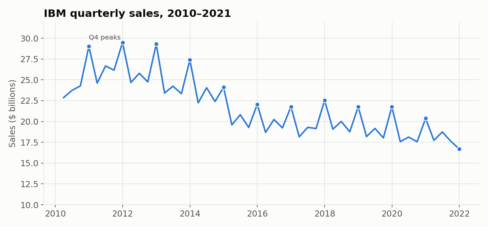
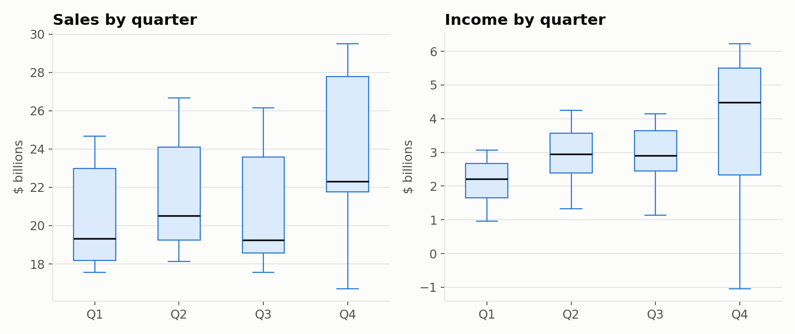

# IBM Sales and Earnings Forecast

In this project I used 12 years of IBM's quarterly results to forecast where sales and earnings were headed and to see how much each quarter of the year tends to differ. I built it in Tableau as part of a data analytics lab.

**Tools:** Tableau

**Data:** IBM quarterly sales and income before extraordinary items, Q1 2010 to Q4 2021 (48 quarters, in millions of dollars)

## What I did

- Built a **3-year forecast** for both sales and income using Tableau's built-in forecasting. It uses exponential smoothing and picks up seasonal patterns on its own. I left the 95% prediction bands on so the forecast shows a range, not just a single line.
- Built **box plots by quarter** next to each forecast to show how Q1, Q2, Q3, and Q4 compare over the 12 years.
- Left the last quarter out of the model fit (a Tableau setting) so an incomplete or unusual final quarter doesn't throw off the forecast.

## What I found

- **Sales have been shrinking for a decade.** Yearly sales peaked at $106.9 billion in 2011 and fell to $70.8 billion by 2021. The forecast carries that downward trend forward.
- **Q4 is IBM's biggest quarter.** Median Q4 sales were $22.3 billion, compared to about $19 to $20.5 billion in the other quarters. Business customers tend to spend what's left of their budgets at year end, which fits this pattern.
- **Q4 income is the highest and the most unpredictable.** Median Q4 income was $4.5 billion, but the Q4 box plot is also the widest. It includes IBM's only losing quarter in the data, Q4 2017 (a loss of about $1.05 billion), which came from a one-time tax charge after the 2017 U.S. tax law changed.
- **Q4 2021 broke the pattern.** Sales dropped to $16.7 billion, the lowest in the data. IBM spun off its infrastructure services business (Kyndryl) in November 2021, so part of that drop is a smaller company, not just weaker demand. Anyone using this forecast should keep that in mind, since the model treats the spin-off like any other decline.

*These preview charts were made from the project data so they show up on GitHub. The forecasts and box plots I built are in the Tableau workbook.*

## Files

| File | What it is |
|---|---|
| `Sales Forecast Tableau.twb` | Tableau workbook with the sales and earnings forecasts and box plots |
| `Lab_8_6_Data.xlsx` | Quarterly IBM data the workbook reads |

**To open the workbook:** open the `.twb` in Tableau Desktop or Tableau Public. If Tableau asks where the data is, point it to `Lab_8_6_Data.xlsx` in the same folder.
